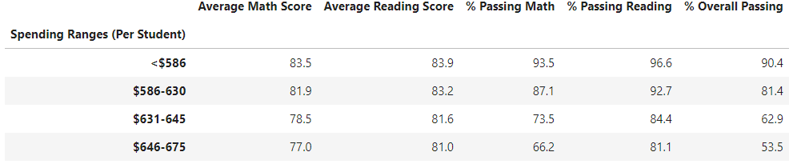
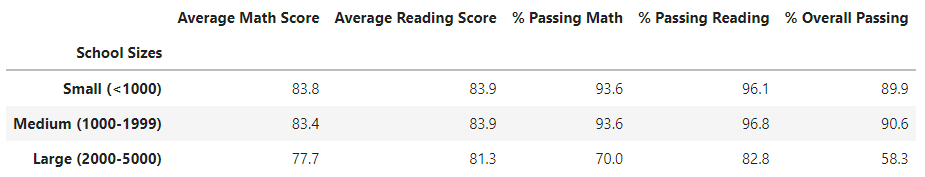

# School_District_Analysis
[School District Analysis](./PyCitySchools_Challenge.ipynb)

## Overview
The school board has noticed that there is evidence of academic dishonesty, specifically, reading and math grades for Thomas High School ninth graders. They have notified Maria and her supervisor and asked for help. Replace the math and reading scores for Thomas High School ninth graders with NaNs while keeping the rest of the data intact. After replacing the math and reading scores, repeat the school district analysis and write a report describing how the changes affected the overall analysis.

## Results: 
- ### How is the district summary affected?
#### Original District Summary

#### New District Summary

The district summary is only slightly affected. In the New District Summary:
  - The Average Math Score is 0.1% lower.
  - The Average Reading Score is the same.
  - The % Passing Math is 0.2% lower.
  - The % Passing Reading is 0.1% lower.
  - The % Overall Passing is 0.3% lower.

- ### How is the school summary affected?
#### Original School Summary - Thomas High School

#### New School Summary - Thomas High School

The scores for Thomas High School are is only slightly affected, the scores for all the other schools are not affected. For Thomas High School, the biggest difference is in the % Passing Reading and the % Passing Overall which are approximately 0.3% lower in the New School Summary than the Original School Summary.

- ### How does replacing the ninth graders’ math and reading scores affect Thomas High School’s performance relative to the other schools?
It doesn't change it much.

- ### How does replacing the ninth-grade scores affect the following:
#### Math and reading scores by grade
##### Original Math Scores by School

##### New Math Scores by School

##### Original Reading Scores by School

##### New Reading Scores by School

Everything is the same, but the scores for 9th grade for the "New Math Scores by School" and "New Reading Scores by School" have "nan" because those values were taken out in the analysis.

#### Scores by school spending
##### Original School Spending

##### New School Spending

Everything is the same, but the "New School Spending" % Passing Reading and % Overall Passing for the $631-645 Spending Range(Per Student) is 0.1% lower than in the "Original School Spending" table.

#### Scores by school size
##### Original Scores by School Size

##### New Scores by School Size

Everything is the same, but the "New School Spending" % Passing Reading for the Medium(1000-1999) for the School Size is 0.1% lower than in the "Original Scores by School Size" table.

#### Scores by school type
##### Original Scores by School Type

##### New Scores by School Type

There is no change or the change is so small, it can't be noticed from the significant digits used.

#### Summary: 
The district summary is only slightly affected. In the New District Summary, the Average Math Score is 0.1% lower, the Average Reading Score is the same, the % Passing Math is 0.2% lower, the % Passing Reading is 0.1% lower, and the % Overall Passing is 0.3% lower.
